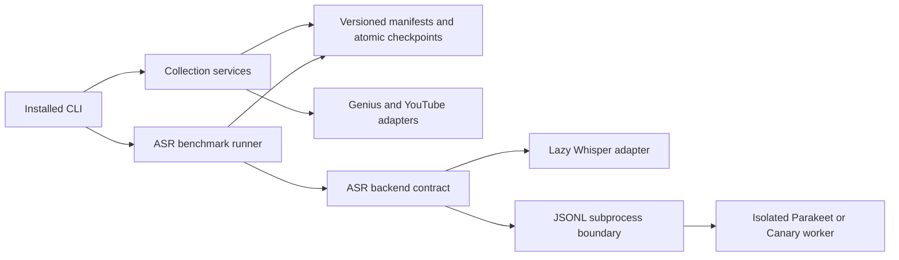

# Dominican Eaters 🇩🇴

**Dominican Eaters** is a pipeline for collecting Dominican books, lyrics, and poetry metadata and for evaluating Dominican Spanish speech systems used in language-model research. The project is moving to a clean, installable Python architecture with one canonical package, one CLI, strict versioned data contracts, restartable collection workflows, and isolated model environments.

The supported runtime lives in `src/dominican_eaters`. Historical top-level modules and the old root `cli.py` remain migration inputs and are not supported interfaces for new development.

## Platform Requirements

> **Core environment:** Python 3.11+, pip, and Git. Python 3.12 is recommended for development and model workers.

- Python 3.11 or newer for the core package
- Python 3.11 or 3.12 for the isolated NeMo worker
- Internet access and API credentials for live Genius and YouTube collection
- FFmpeg for workflows that inspect or process audio
- CUDA-compatible drivers only when GPU inference is requested

## Dependencies

- Base runtime dependencies and the `dominican-eaters` console command are declared in `pyproject.toml`.
- `providers` installs the optional HTTP client for Genius and YouTube.
- `whisper` installs the compatible OpenAI Whisper and PyTorch dependencies.
- Parakeet and Canary run from the independently packaged `workers/nemo` environment.
- Development tools are kept out of the published runtime dependencies.

## Quick Installation

1. Clone the repository.

```bash
git clone https://github.com/lopezbec/Dominican-eaters_Dominican_LLM_project.git
cd Dominican-eaters_Dominican_LLM_project
```

2. Create and install the lightweight core environment.

```bash
python3.12 -m venv .venv
.venv/bin/python -m pip install --upgrade pip
.venv/bin/python -m pip install -e .
```

3. Install the extras needed by the workflow you intend to run.

```bash
# Live collection providers
.venv/bin/python -m pip install -e '.[providers]'

# Whisper benchmark environment; preferably install in its own virtual environment
.venv/bin/python -m pip install -e '.[whisper]'
```

4. Inspect the installed CLI and validate the canonical configuration.

```bash
.venv/bin/dominican-eaters --help
.venv/bin/dominican-eaters config validate config/default.yaml
```

## Features

- Strict configuration with explicit data and artifact roots
- Versioned STT manifests with stable sample identities and optional SHA-256 verification
- Canonical corpus WER/CER, coverage reporting, silence controls, and grouped bootstrap intervals
- Atomic benchmark manifests, per-sample checkpoints, and final result artifacts
- Lazy Whisper loading with strict device and precision selection
- Isolated Parakeet and Canary workers over a validated JSONL process protocol
- Model-load timing, inference timing, real-time factor, process-tree RSS, and CUDA allocator peaks
- Restartable books, lyrics, and poems collection with stable IDs and explicit outcomes
- Typed Genius and YouTube adapters with deterministic identity matching
- Single-writer locks and atomic collection checkpoints that preserve failures and pending work
- Lightweight help, configuration, manifest validation, and scoring without importing model runtimes

## Usage

### Collection

Validate each strict source manifest without making provider calls:

```bash
.venv/bin/dominican-eaters collect books preflight path/to/books.json
.venv/bin/dominican-eaters collect lyrics preflight path/to/lyrics.json
.venv/bin/dominican-eaters collect poems preflight path/to/poems.json
```

Live collection reads credentials only from environment variables. They are not accepted as command-line values and are not written to artifacts.

```bash
export YOUTUBE_API_KEY='...'
export GENIUS_ACCESS_TOKEN='...'  # required only for lyrics

.venv/bin/dominican-eaters collect books run path/to/books.json \
  --output-dir artifacts/books
.venv/bin/dominican-eaters collect lyrics run path/to/lyrics.json \
  --output-dir artifacts/lyrics
.venv/bin/dominican-eaters collect poems run path/to/poems.json \
  --output-dir artifacts/poems
```

These commands collect metadata, lyrics, and selected media links; they do not download media. Use `--force` to reprocess the current manifest. Provider failures return a nonzero exit while retaining restartable state.

### STT manifest validation

An STT manifest declares a dataset root and one stable record per utterance. Validate file availability before loading a model:

```bash
.venv/bin/dominican-eaters stt preflight path/to/manifest.json
.venv/bin/dominican-eaters stt preflight path/to/manifest.json --verify-hashes
```

Moving a dataset is explicit and verifies all declared hashes:

```bash
.venv/bin/dominican-eaters stt preflight path/to/manifest.json \
  --dataset-root /srv/datasets/stt-evaluation
```

### Whisper benchmark

```bash
.venv/bin/dominican-eaters stt benchmark path/to/manifest.json \
  --output-dir artifacts/whisper-base-run \
  --backend whisper \
  --model base \
  --language es \
  --device auto \
  --precision auto
```

The output directory must be new. The command returns zero only for a complete run. Load, inference, scoring, interruption, and cleanup failures retain structured checkpoint evidence.

### Parakeet and Canary benchmarks

Create the isolated worker with Python 3.11 or 3.12:

```bash
python3.12 -m venv .venv-nemo
.venv-nemo/bin/python -m pip install -e .
.venv-nemo/bin/python -m pip install -e ./workers/nemo
```

Run either backend through its absolute worker interpreter:

```bash
.venv/bin/dominican-eaters stt benchmark path/to/manifest.json \
  --output-dir artifacts/parakeet-run \
  --backend parakeet \
  --language es \
  --worker-python "$PWD/.venv-nemo/bin/python"

.venv/bin/dominican-eaters stt benchmark path/to/manifest.json \
  --output-dir artifacts/canary-run \
  --backend canary \
  --language es \
  --worker-python "$PWD/.venv-nemo/bin/python"
```

Defaults are `nvidia/parakeet-tdt-0.6b-v3` and `nvidia/canary-1b-v2`. Both workers currently accept Spanish only.

## STT/TTS Benchmarking

Standalone research scripts and their model-specific environments remain under `testing/stt` and `testing/tts`. They are intentionally separate from the installed production package. See `testing/README.md` for Whisper, Parakeet, Canary, XTTS, F5, Kokoro, acta preparation, and poem benchmark instructions.

## Output Structure

Canonical paths come from `config/default.yaml` or explicit CLI overrides:

```text
data/                       # source datasets and manifests
artifacts/
  books/books-collection.json
  lyrics/lyrics-collection.json
  poems/poems-collection.json
  <benchmark-run>/
    manifest.json           # frozen benchmark input
    checkpoint.json         # incremental sample-level state
    result.json             # final structured result
```

Collection JSON files are the source of truth for resume. CSV/XLSX files will be derived projections rather than mutable state.



## Text Alignment and Verification

The canonical evaluator reports coverage before quality. WER and CER use explicit normalization, aggregate edit counts over the corpus, and reject ambiguous empty-reference cases. Runtime reporting separates model loading from inference and records requested and effective device and precision settings.

The scientific policy is documented in `docs/speech-evaluation-metrics.md`.

## Architecture

- `src/dominican_eaters/data`: configuration-independent manifests, serialization, and locking
- `src/dominican_eaters/collection`: provider-independent books, lyrics, and poems domains
- `src/dominican_eaters/collection/providers`: shared external provider adapters
- `src/dominican_eaters/speech/asr`: backend contracts, Whisper, subprocess control, and worker protocol
- `src/dominican_eaters/evaluation/asr`: benchmark orchestration, checkpoints, scoring, and artifacts
- `workers/nemo`: separately installable Parakeet and Canary runtime
- `tests/core`: fast default tests without network, GPU, or model downloads

This is a clean break. New code does not add compatibility wrappers, aliases, dual readers, or dual writers for replaced interfaces. Historical data that must survive will use a checksummed one-time converter.

## Development Practices

- Use Python type hints and `logging` outside CLI presentation.
- Keep model and network imports lazy.
- Keep secrets in environment variables and out of artifacts and logs.
- Put runtime code under `src/dominican_eaters`; keep experiments outside the installed package.
- Keep implementations and directly corresponding tests together.
- Run the default verification suite before submitting changes:

```bash
ruff format --check src tests/core
ruff check src tests/core
mypy src
pytest -q
python -m build

ruff format --check workers/nemo/src workers/nemo/tests
ruff check workers/nemo/src workers/nemo/tests
cd workers/nemo && mypy src && pytest -q
```

## Contributing

1. Create a focused branch.
2. Keep changes in reviewable Angular Conventional Commits.
3. Run the relevant targeted tests and the default suite.
4. Open a pull request explaining the behavior, verification, and remaining operational risks.

## Troubleshooting

- **Missing provider dependency:** install `.venv/bin/python -m pip install -e '.[providers]'`.
- **Missing API credential:** set `YOUTUBE_API_KEY`; lyrics also requires `GENIUS_ACCESS_TOKEN`.
- **Whisper out of memory:** select a smaller model, use `--device cpu`, or use an isolated GPU environment.
- **Parakeet/Canary worker rejected:** use Python 3.11 or 3.12 and pass the absolute `--worker-python` path.
- **Manifest preflight failure:** check the declared dataset root, relative audio paths, duplicate IDs, and hashes.
- **Existing benchmark output:** choose a new output directory; benchmark runs are immutable.

Live provider requests, real model inference, and execution on the FONDOCYT server still require separate operational verification.

## Acknowledgment

This project has been partially supported by the Ministerio de Educación Superior, Ciencia y Tecnología (MESCyT) of the Dominican Republic through the FONDOCYT grant. The authors gratefully acknowledge this support.

Any opinions, findings, conclusions, or recommendations expressed in this material are those of the authors and do not necessarily reflect the views of MESCyT.

## Support

Open an issue on GitHub for questions or collaboration requests.

---

*Maintainers: keep filesystem roots in `config/default.yaml`, scientific policies in versioned contracts, and model-specific dependencies in isolated environments.*
