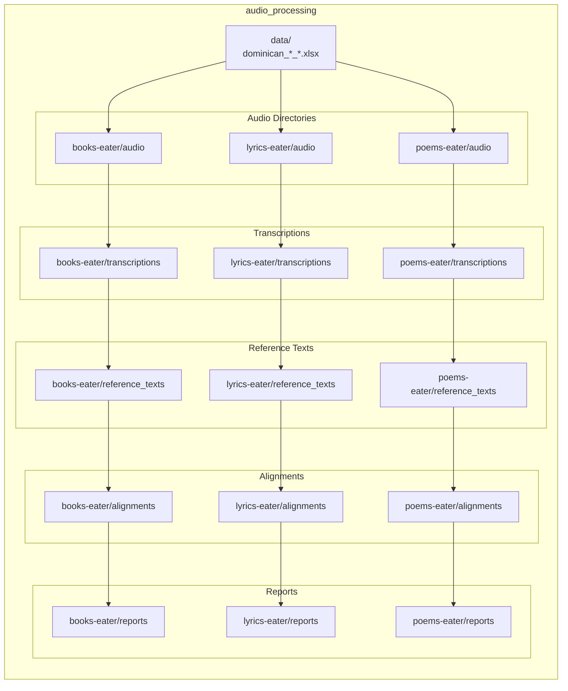

# Dominican Eaters 🇩🇴

**Dominican Eaters** is a professional pipeline for collecting, processing, and aligning Dominican Spanish audio content (audiobooks, song lyrics, poetry) from YouTube for Large Language Model training. This document provides a concise, enterprise-grade overview, installation instructions, usage examples, and the exact output layout used by the pipeline.

## Platform Requirements

> **Environment**: Python 3.8+ (3.13 recommended), FFmpeg, Git. CUDA available for Whisper when GPU is present.

- Python 3.8 or newer
- FFmpeg for audio processing
- Internet connection for scraper modules

## Dependencies

- See `requirements.txt` at repository root for the consolidated dependency list.
- Optional GPU: CUDA drivers for Whisper model acceleration.

## Quick Installation

1. Clone repository

```bash
git clone https://github.com/yourusername/Dominican-eaters_Dominican_LLM_project.git
cd Dominican-eaters_Dominican_LLM_project
```

2. Create and activate virtual environment

```bash
python -m venv .venv
source .venv/bin/activate  # Linux/macOS
```

3. Install dependencies

```bash
pip install -r requirements.txt
```

4. Configure lyrics module (Genius API)

```bash
cd lyrics-eater
cp .env.example .env
# Edit .env and add your Genius API token
```

## Features

- Automated YouTube metadata scraping for books, lyrics and poems
- Bulk audio download via `yt-dlp`
- Whisper-based transcription (partial and full modes)
- Multi-metric alignment and verification (WER, char similarity, jaccard, cosine)
- Export of processed metadata and reports for dataset generation

## Usage

Run the main CLI for full pipeline or per-module operations (recommended):

```bash
# Full pipeline for all modules
python cli.py pipeline --type all

# Run all steps for a specific module
python cli.py pipeline --type lyrics-eater

# Individual operations
python cli.py scrape --type books
python cli.py download --type lyrics-eater
python cli.py transcribe --type books-eater --model base
python cli.py align --type lyrics-eater
python cli.py validate --type all
```

Available Whisper models: `tiny`, `base`, `small`, `medium`, `large`, `large-v2`, `large-v3`. Use `--partial` for partial transcriptions (lyrics use partial mode during collection by default).

## Output Structure (Exact Paths)

The pipeline stores module-specific outputs according to `audio_processing/config.yaml`. The following entries are used as-is by the system configuration:



Notes:
- Paths above are repository-relative and intentionally reference module-local directories (e.g., `books-eater/audio`).
- Excel metadata outputs are placed under `audio_processing/data/`.
- Reports are stored per-module in the `reports` directory listed per module.


Notes:
- Paths above are repository-relative and intentionally reference module-local directories (e.g., `books-eater/audio`).
- Excel metadata outputs are placed under `audio_processing/data/`.
- Reports are stored per-module in the `reports` directory listed per module.

## Text Alignment & Verification

The pipeline performs multi-metric evaluation for transcription quality using thresholds and parameters from `audio_processing/config.yaml` (WER, char similarity, Jaccard, cosine). Lyrics processing uses partial transcriptions (first 45 seconds) for rapid verification.

## Development Practices

- Follow Python typing and style rules (type hints mandatory, 4-space indent, 100-char line length)
- Use `logging` instead of `print` for non-CLI output
- Configuration is centralized in `audio_processing/config.yaml` — edit that file to change module output paths or processing parameters

## Contributing

1. Fork the repository and create a feature branch.
2. Run tests and linters locally.
3. Open a pull request with a clear description of changes.

## Troubleshooting

- FFmpeg missing: install via your OS package manager
- Whisper OOM: use smaller model (`tiny`, `base`) or switch to CPU
- YouTube download failures: update `yt-dlp` and check video availability

## License

This project is developed for academic research in Dominican Spanish NLP. See repository license for details.

## Support

Open an issue on GitHub for questions or collaboration requests.

---

*Maintainers: please ensure `audio_processing/config.yaml` remains the source of truth for module paths and thresholds.*
