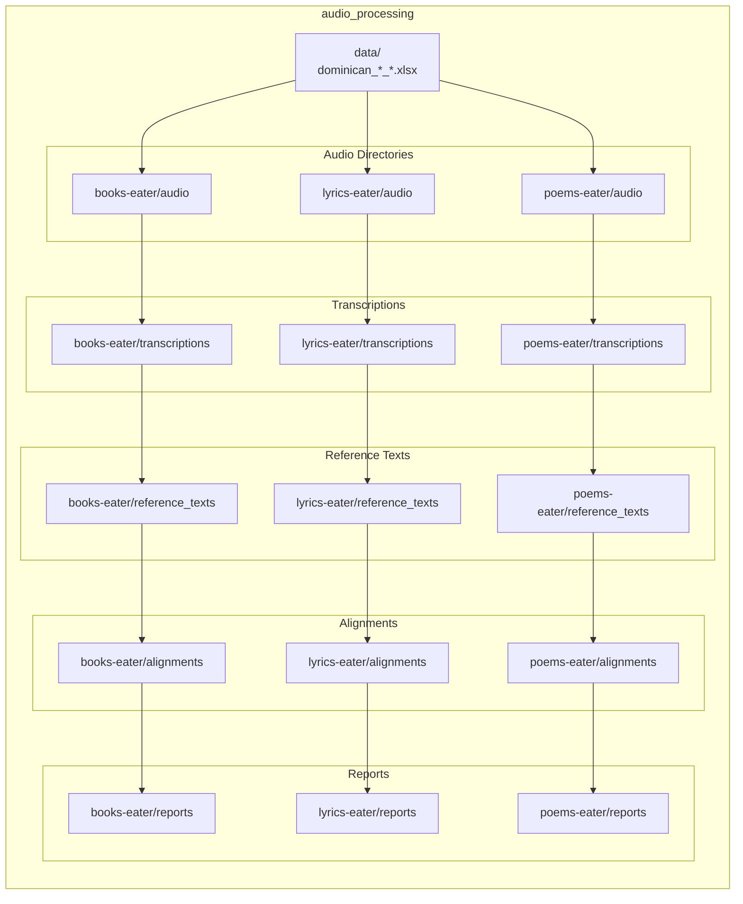

# Dominican Eaters 🇩🇴

**Dominican Eaters** is a professional pipeline for collecting, processing, and aligning Dominican Spanish audio content (audiobooks, song lyrics, poetry) from YouTube for Large Language Model training. This document provides a concise, enterprise-grade overview, installation instructions, usage examples, and the exact output layout used by the pipeline.

## Platform Requirements

> **Environment**: uv, Python 3.12+, FFmpeg, Git. CUDA available for Whisper when GPU is present.

- uv and Python 3.12 or newer
- FFmpeg for audio processing
- Internet connection for scraper modules

## Dependencies

- Runtime dependencies are defined in `pyproject.toml` and locked in `uv.lock`.
- Optional GPU: CUDA drivers for Whisper model acceleration.

## Quick Installation

1. Clone repository

```bash
git clone https://github.com/yourusername/Dominican-eaters_Dominican_LLM_project.git
cd Dominican-eaters_Dominican_LLM_project
```

2. Create uv environment and install dependencies

```bash
uv sync
```

3. Configure lyrics module (Genius API)

```bash
cd lyrics-eater
cp .env.example .env
# Edit .env and add your Genius API token
```

## Features

- Automated YouTube metadata scraping for books, lyrics and poems
- Bulk audio download via `yt-dlp`
- Whisper-based transcription (partial and full modes)
- Multi-metric alignment and verification (WER, char similarity, jaccard, cosine)
- Export of processed metadata and reports for dataset generation

## Usage

Run the main CLI for full pipeline or per-module operations (recommended):

```bash
# Scrape (module values: books, lyrics, poems, all)
uv run python cli.py scrape --module books
uv run python cli.py scrape --module all

# Download audio (module values: books-eater, lyrics-eater, poems-eater, all)
uv run python cli.py download --module lyrics-eater
uv run python cli.py download --module all --force

# Transcribe (module values: books-eater, lyrics-eater, poems-eater, all)
uv run python cli.py transcribe --module lyrics-eater --model base
uv run python cli.py transcribe --module books-eater --model large
uv run python cli.py transcribe --module lyrics-eater --partial

# Align (module values: books-eater, lyrics-eater, poems-eater, all)
uv run python cli.py align --module lyrics-eater
uv run python cli.py align --module all

# Validate (module values: books-eater, lyrics-eater, poems-eater, all)
uv run python cli.py validate --module lyrics-eater
uv run python cli.py validate --module all

# Pipeline (module values: books, lyrics, poems, all)
uv run python cli.py pipeline --module lyrics
uv run python cli.py pipeline --module all --skip-scrape --model large
uv run python cli.py pipeline --module books --force

Notes:
- Use `--partial` for partial transcription (lyrics collection uses partial mode by default when using the `pipeline` command with `--module lyrics`).
- To see help for any command: `uv run python cli.py <command> --help`.
```

## STT/TTS Benchmarking on Lyrics Dataset

For UV-only reproducible ASR/TTS benchmarking on `lyrics-eater/audio` (including Genius-based ASR scoring and model ranking), see `testing/README.md`.

Available Whisper models: `tiny`, `base`, `small`, `medium`, `large`, `large-v2`, `large-v3`. Use `--partial` for partial transcriptions (lyrics use partial mode during collection by default).

## Output Structure (Exact Paths)

The pipeline stores module-specific outputs according to `audio_processing/config.yaml`. The following entries are used as-is by the system configuration:



Notes:
- Paths above are repository-relative and intentionally reference module-local directories (e.g., `books-eater/audio`).
- Excel metadata outputs are placed under `audio_processing/data/`.
- Reports are stored per-module in the `reports` directory listed per module.


Notes:
- Paths above are repository-relative and intentionally reference module-local directories (e.g., `books-eater/audio`).
- Excel metadata outputs are placed under `audio_processing/data/`.
- Reports are stored per-module in the `reports` directory listed per module.

## Text Alignment & Verification

The pipeline performs multi-metric evaluation for transcription quality using thresholds and parameters from `audio_processing/config.yaml` (WER, char similarity, Jaccard, cosine). Lyrics processing uses partial transcriptions (first 45 seconds) for rapid verification.

## Development Practices

- Follow Python typing and style rules (type hints mandatory, 4-space indent, 100-char line length)
- Use `logging` instead of `print` for non-CLI output
- Configuration is centralized in `audio_processing/config.yaml` — edit that file to change module output paths or processing parameters

## Contributing

1. Fork the repository and create a feature branch.
2. Run tests and linters locally.
3. Open a pull request with a clear description of changes.

## Troubleshooting

- FFmpeg missing: install via your OS package manager
- Whisper OOM: use smaller model (`tiny`, `base`) or switch to CPU
- YouTube download failures: update `yt-dlp` and check video availability

## Acknowledgment

This project has been partially supported by the Ministerio de Educación Superior, Ciencia y Tecnología (MESCyT) of the Dominican Republic through the FONDOCYT grant. The authors gratefully acknowledge this support.

Any opinions, findings, conclusions, or recommendations expressed in this material are those of the authors and do not necessarily reflect the views of MESCyT.

## Support

Open an issue on GitHub for questions or collaboration requests.

---

*Maintainers: please ensure `audio_processing/config.yaml` remains the source of truth for module paths and thresholds.*
