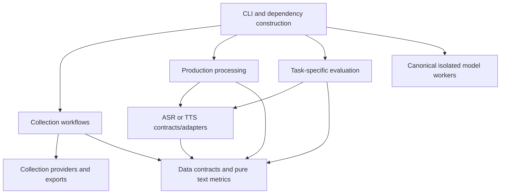

# Architecture review and incremental refactoring plan

**Status:** accepted clean-break plan; the canonical STT and collection architectures are
implemented with offline coverage. Replaced application code has been removed from the working
architecture; the preserved external snapshot remains historical evidence for later data conversion.

## Implementation progress

Implemented under `src/dominican_eaters` and `workers/nemo`:

- explicit wheel metadata and the installed `dominican-eaters` console command;
- strict version-1 application configuration and STT manifest contracts;
- dependency-light ASR contracts, lifecycle runner, and canonical WER/CER policy;
- atomic frozen manifests, per-sample checkpoints, and structured final results;
- lazy Whisper plus isolated Parakeet and Canary workers behind a strict JSONL protocol;
- subprocess timeouts, request correlation, stderr draining, and termination escalation;
- requested/effective runtime provenance, model-load and inference timing, RTF, sampled host and process-tree RSS,
  and CUDA allocator peaks;
- a canonical dependency-light root test suite and an independent NeMo worker suite;
- the first books collection contracts: stable IDs, strict manifests, explicit outcomes, and
  interruption-safe resume checkpoints that retain the whole source catalog;
- dependency-light lyrics and poems domains with strict source contracts, typed provider ports,
  deterministic selection, explicit partial/error outcomes, and single-writer atomic ledgers.
- lazy YouTube Data API and Genius adapters behind an optional `providers` dependency extra;
- credential-safe `collect books|lyrics|poems run` commands with deterministic matching,
  typed provider failures, resumable artifacts, and offline adapter/CLI tests.

The root suite passes 181 tests; the NeMo worker suite passes 12. Ruff formatting/linting and strict
mypy pass for both packages. Fresh wheel and clean-install smoke results are recorded after each
build rather than inferred from source. Credentialed Genius/YouTube requests, real model inference,
process-tree RSS validation, fixed model revision pinning, the server runtime, and a reviewed
benchmark dataset remain unverified.


## 1. Recommendation

Keep one repository and introduce **one installable core package, organized by workflow**, with explicit boundaries for providers, model backends, data contracts, and evaluation. Keep separate Python processes/environments where ML dependencies or global library patches require them.

The project does not currently need microservices, a task queue, a plugin framework, a dependency-injection container, or a universal pipeline superclass. The immediate needs are reliable execution, stable data contracts, reproducible evaluations, and imports that work outside the checkout directory. This is a design judgment based on the code, not a requirement imposed by a Python standard.

Use **STT manifest → transcription → scoring** as the first vertical slice, implemented directly on the new contracts. Existing defects become regression scenarios; repairing the old architecture is not a prerequisite. This is a deliberate clean break: the finished system has one package, one CLI, one canonical configuration model, and one set of versioned data contracts. Old commands, import paths, folder launchers, and historical JSON shapes are not supported by the new system. Existing datasets must be protected and deliberately converted, but old application interfaces need not remain callable.

The implementation can still proceed in small, reviewable commits on the migration branch. Incremental development here is a risk-control technique, not a promise that old and new architectures operate simultaneously in production.

### Clean-break constraints

- No compatibility wrappers, import aliases, deprecated CLI aliases, dual readers, or dual writers.
- No requirement that new scores match historical leaderboards whose metric policies differ.
- No old code on the installed import path after cutover.
- Historical data needed for the project is handled by a checksummed, one-time converter with an explicit rejection report.
- Rollback restores the pre-cutover Git/data/environment snapshot; it does not keep two supported architectures.

## 2. Evidence and current risks

Three subagents separately examined collection/shared code, speech/evaluation code, and authoritative Python guidance. The main review covered the CLI, configuration, dependencies, and targeted offline reproductions. Findings below distinguish executed checks from source-derived risks. This is not a complete functional audit or a server benchmark.

| Finding | Evidence in this working tree | Impact and priority |
| --- | --- | --- |
| CLI failure is reported as success | `cli.py:131`, `:196`, `:297` print child failures without propagating them; `:404` announces pipeline success. Reproduced with mocked child exit code 7: both `download` and `pipeline` returned 0. | **Fix before restructuring.** Automation cannot trust completion. Define stage outcomes and exit policy. |
| Three collectors use the same import name `src` | `books-eater/main.py:11,19`, `poems-eater/main.py:11,19`, `lyrics-eater/main.py:5,13`; `cli.py:68` currently launches them in separate processes. | Moving them into one interpreter first could load the wrong cached package. Introduce named imports before changing execution boundaries. |
| Failed collection records can disappear from resume input | `shared/services/base_service.py:28` returns `None` for unsuccessful processing; `shared/base/base_runner.py:206` removes these before export; `books-eater/main.py:62` and `poems-eater/main.py:62` resume from exports. | **Protect data identity first.** An offline service probe confirmed failure becomes `None`; the full spreadsheet/resume loss path is source-derived, not a complete reproduced cycle. |
| Frozen STT manifests cannot always be replayed | `testing/stt/benchmark.py:54,59` resolves relative `audio_file`, then stores both that string and absolute `audio_path`; the loader ignores `audio_path`. Reproduced: a snapshot written under a new run directory resolves the audio against that directory and fails. | Make this a regression scenario for the new manifest design. Do not generalize or repair the old runner as the production solution. |
| Configuration has competing implementations | `audio_processing/src/config/manager.py:84` expands YAML into dataclasses lacking `partial_duration` and several alignment fields; `utils/config_loader.py:7` returns raw dictionaries. Direct constructor probes reproduced unexpected-keyword errors. | Do not replace the active dictionary loader with the typed loader as-is. The normal downloader/transcriber CLI paths currently use `ConfigLoader`; this is not evidence that all production commands fail on this mismatch. |
| Paths depend on the checkout and working directory | `cli.py:63,121,239,416`; `shared/utils/module_config.py:24`; config is independently duplicated across collectors. An out-of-repository scrape probe reported a missing script and still exited 0. | Centralize path resolution before moving files. `setup` should derive directories from configuration instead of a second list. |
| Transcription contracts disagree | Production `audio_processing/src/transcriber.py:45` uses `success`/`transcription`/`audio_path`; `testing/stt/whisper_model.py:133` uses `transcript`/`file`; the new runner adds `status`. | Choose and validate one new schema. Convert retained datasets/results once if they are needed; do not add permissive runtime readers for every old shape. |
| Metrics share names but not definitions | WER exists in `audio_processing/src/utils/metrics.py`, `audio_processing/src/metrics/text_similarity.py`, `testing/stt/scoring.py`, and both TTS evaluators. Normalization and empty-reference policies differ. | Choose and document one scientific policy, then recompute the new baseline. Historical leaderboard equivalence is not a migration requirement. |
| Optional dependencies leak into unrelated operations | `scripts/llm_eval_common.py:11` eagerly imports Torch, including for the HTTP Ollama runner; `testing/tts/chatterbox_tts.py:58` globally replaces `torch.load`; some evaluators import models before argument parsing. | Lightweight CLI/help/scoring must not require GPU libraries. Confine backend imports and global patches to their environment/lifecycle. |
| Existing abstractions obscure ownership | `shared/clients/adapters.py:16` applies an injected client only to audiobook search and constructs other clients; `shared/base/base_runner.py:93` bypasses its save hook, and `:214` treats either writer succeeding as success. | Prefer explicit dependencies and result types over more inheritance. Characterize provider behavior and dual-export semantics first. |
| Python support promises disagree | The canonical core now requires Python >=3.11 and the NeMo worker >=3.11,<3.13, while the root `AGENTS.md` still says 3.8+. Explicit setuptools metadata and the console entry point are implemented. | Update repository policy at cutover and verify the core/worker compatibility matrix rather than promising one interpreter for every model. |
| Existing syntax failure | `shared/services/transcription_exporter.py:28` has an indentation error, previously confirmed identical to Git HEAD. | Isolate its repair from package moves; inspect the rest of the file rather than assuming one whitespace fix completes the repair. |

These findings prioritize correctness and scientific traceability over cosmetic directory changes.

## 3. Proposed package boundaries

This is a target map, not a request to create every directory immediately. Start with only the files needed for the first migrated workflow.

```text
src/dominican_eaters/
  __init__.py                 # no model imports or setup side effects
  __main__.py                 # python -m dominican_eaters
  cli/                        # parsing, presentation, dependency construction
  config.py                   # explicit loading, validation, path resolution
  data/                       # versioned manifests, artifact records, serialization
  collection/
    books/                    # book-specific inputs, search decisions, domain records
    lyrics/
    poems/
    providers/                # YouTube/Genius adapters shared by collection modules
    exports/                  # spreadsheet/CSV mappings, columns, formatting
  speech/
    asr/                      # narrow ASR contract and backend adapters
    tts/                      # distinct synthesis contract and adapters
  processing/                 # production download/transcribe/align/validate workflows
  evaluation/
    asr/                      # benchmark orchestration, aggregation, uncertainty
    tts/                      # synthesis evaluation; independent from ASR evaluation
    llm/                      # perplexity/task evaluation; independent result payloads
    resources.py              # scoped timing and memory measurement
  text_metrics.py             # pure edit-count kernels and named normalization policies

environments/                # reproducible, separate backend setup specifications
experiments/                 # exploratory scripts not yet promoted into the package
tests/                       # fast tests, contract fixtures, separately selected integration tests
docs/                       # architecture decisions, metric protocol, run instructions
```

The target removes root `cli.py`, the `*-eater/main.py` launchers, ambiguous `src` imports, and runnable production code under `testing/` and `scripts/`. During development, old code may remain available only as a reference until its replacement passes the new contract tests; it does not receive shims or dual-write support. At cutover, archive the source-only ZIP outside the import path and delete replaced implementation.

Existing data is not disposable. Define one canonical data root and perform a dry-run, checksummed conversion into the new layout. Do not make new runtime code understand both layouts. Retain the original data and conversion report until the new dataset is verified.

PyPA explains the distinction between a source directory and an import package: use `src/dominican_eaters`, not three unrelated packages all imported as `src`. A `src` layout requires installation and helps reveal accidental dependence on repository-root imports. [PyPA layout guidance](https://packaging.python.org/en/latest/discussions/src-layout-vs-flat-layout/).

### Dependency direction

Arrows below mean permitted imports/composition, not a mandatory processing sequence. Model workers can communicate through files rather than Python imports.



Rules to enforce as modules migrate:

- Pure data records and text metrics do not import CLI, collectors, model runtimes, or benchmark runners.
- Production processing does not import evaluation runners. Evaluation does not invoke scraping as a hidden prerequisite.
- ASR, TTS, and LLM evaluation retain separate payloads and workflows. Share genuinely common run metadata, coverage helpers, and measurement code only.
- Collection providers know network APIs; domain decisions and retry/resume identity do not live inside Excel formatting code.
- Select and construct dependencies at the CLI/application boundary. Importing a module must not load weights, initialize credentials, configure global logging, or alter another library.

Import Linter can enforce forbidden dependencies and acyclic/independent package boundaries across the new package. Old source directories are excluded only while they await deletion. [Import Linter documentation](https://import-linter.readthedocs.io/en/stable/).

## 4. Contracts worth introducing

### Typed inputs and outcomes

Use small dataclasses for internal records and narrow protocols at actual substitution points. These express contracts but do not replace JSON/YAML validation: dataclasses do not enforce annotated field types, and runtime-checkable protocols do not verify full method signatures. [Python dataclasses](https://docs.python.org/3/library/dataclasses.html), [Python protocols](https://typing.python.org/en/latest/reference/protocols.html).

Suggested records, to be refined from fixtures:

| Contract | Essential responsibilities |
| --- | --- |
| `AudioSample` | Stable `sample_id`, audio locator, reference text/provenance, split, group ID, optional content hash. Identity is not a basename or absolute filesystem path. |
| `TranscriptionResult` | Sample ID, explicit status, text (possibly empty), backend/run identity, optional segments and structured error. |
| `BenchmarkConfig` | Validated options independent of argparse/Click; paths, selection, backend configuration, timing and scoring policy. |
| `RunMetadata` | Schema version, code/model/runtime identity, effective configuration, input hashes, measurement boundaries and units. |
| `CollectionOutcome` | Original record identity plus found/partial/not-found/error status. Failed and not-yet-processed records remain eligible for retry and export, including after interruption. |
| `StageResult` / writer outcome | Expected/completed/failed counts, artifact paths, errors, and explicit partial-success semantics. |

An ASR backend should expose only the lifecycle and transcription behavior its callers need. The runner owns load, warmup, iteration, error reporting, and close. The backend owns device/model internals and real resource release. A cache-clearing operation is not necessarily model disposal; releasing unused cache does not release live tensors. [PyTorch CUDA memory management](https://docs.pytorch.org/docs/stable/notes/cuda.html).

Do not replace every concrete class with a protocol. A function parameter is sufficient for a simple reader or writer. Reuse provider logic only after its behavior is understood; the old adapter interface itself does not need to survive.

### Versioned data and scientific policy

Define one strict reader and writer for each new task-specific schema. Reject malformed required fields; do not interpret a missing transcript as a successful empty one. New formats carry `schema_version`. If old artifacts remain scientifically useful, run an explicit one-time converter that records the input hash, conversion version, rejected rows, and output hash. Conversion code is a migration tool, not a permanent application dependency.

Resolve audio locators against a declared dataset root or input-manifest directory. A saved run manifest must replay on the same machine; moving data to another machine requires an explicit root remap and content-hash verification. An absolute path is useful provenance but not portable identity. Test save → load → preflight, including duplicate basenames in different directories.

Keep the edit-distance kernel separate from normalization, empty-reference handling, averaging, and ranking policies. Select and version one new policy, then regenerate baseline scores instead of preserving incompatible old leaderboard semantics. Keep alignment similarity and ASR corpus WER distinct. Paired model significance testing remains an explicit later feature, not something implied by individual confidence intervals.

Record expected IDs, failure/missing coverage, and configuration with all evaluations. Fixing a data-loss bug, changing text normalization, changing a model, and moving a module must be separate changes. Seeds do not guarantee identical results across PyTorch releases, hardware, or CPU/GPU execution. [PyTorch reproducibility guidance](https://docs.pytorch.org/docs/stable/notes/randomness.html).

### Configuration and CLI

Use one explicit loader for application configuration, with validation and a documented override order: explicit CLI options → selected config → defaults. Read secrets from environment/explicit dotenv setup at the boundary and redact them from run metadata. Benchmark-specific settings can have their own typed config; they should not silently override production alignment thresholds.

Replace the current YAML with one validated canonical configuration and explicit data root. A one-time conversion maps old locations into the new layout; new runtime code does not infer a repository root from `__file__` and does not contain compatibility path resolution.

The installed CLI should parse arguments, call an application function or worker, render its result, and return the appropriate exit code. Production application functions should not call Click command functions. Define whether an aggregate command continues after individual failures; regardless, return a nonzero exit when the requested workflow is incomplete. Do not retain the old command names as aliases merely for compatibility.

## 5. Packaging and runtime environments

Declare an explicit build backend/package discovery and installed console script. Keep the base package small enough for help, manifest validation, and pure scoring without Torch. Use optional runtime extras for compatible installed features and dependency groups for development tools. Groups are not published runtime requirements and neither groups nor extras create separate environments. [PyPA pyproject specification](https://packaging.python.org/en/latest/specifications/pyproject-toml/), [dependency groups specification](https://packaging.python.org/en/latest/specifications/dependency-groups/).

**Implemented package baseline:** the core requires Python >=3.11, and the NeMo worker requires
Python >=3.11,<3.13. Python 3.12 remains the intended development and shared worker version. The
server matrix is still operationally unverified because SSH connectivity timed out. This policy
does not assert that every model dependency can coexist in one environment.

Current shell code selects Whisper 3.12 and NeMo 3.11. Keep separate reproducible environments, but make both canonical workers consume the same small contracts package when its dependency graph is compatible. Where a backend cannot install it, package that worker separately and communicate through the one new versioned schema. Separate worker packaging is a runtime boundary, not backward compatibility.

Run workers through configured interpreter paths, without depending on shell activation. Specify arguments, working directory, logs, cancellation, timeouts, and exit handling. Virtual environments isolate Python packages, not GPU drivers, system libraries, global device state, or concurrent VRAM usage. [Python virtual environment documentation](https://docs.python.org/3/library/venv.html).

Separate environment provisioning from benchmark execution. Keep backend-specific reproducible requirements/locks and record actual installed versions. Do not combine all ML requirements into one lock by assumption: uv resolves project dependencies, extras, and groups together, and incompatible selections require explicit handling. A multi-package workspace is not automatic runtime isolation. [uv conflicting dependencies](https://docs.astral.sh/uv/concepts/resolution/#conflicting-dependencies).

Keep license acceptance, reference-voice requirements, and model download behavior explicit. A packaging refactor must not silently accept licenses, download weights, or start expensive jobs.

## 6. Migration sequence and acceptance gates

Each row is a bounded change or small series of changes. Do not combine dependency upgrades or scientific-policy changes with module relocation.

| Phase | Work | Gate before continuing |
| --- | --- | --- |
| 0. Protect data and record the starting point | Inventory imported changes, local edits, known bugs, schemas and model environments. Keep the original ZIP. Hash datasets and establish an untouched backup. | Existing fast tests run; known failures are recorded; no user data, credentials, or work are overwritten. |
| 1. Freeze the new contracts | Decide Python support, canonical IDs, config schema, data root, result schemas, metric policy, exit semantics and environment matrix. Write tests against the desired behavior rather than old quirks. | Architecture decision records are accepted; new schema fixtures validate; data conversion has dry-run and collision reports. |
| 2. Build the clean package foundation | Configure explicit build metadata, `src/dominican_eaters`, the installed console entry point, strict config loading, task records and pure metrics. No import shims or old command aliases. | Build/install a wheel in clean Python 3.11 and 3.12 environments; imports/help/config/scoring work outside the checkout; no `sys.path` mutation. |
| 3. Implement the canonical STT slice | Build manifest selection, injected ASR backend, lifecycle, measurement, strict result storage and scoring directly on new contracts. Reuse algorithms only after reviewing their semantics. | Fake backend success/failure/lifecycle tests pass; snapshot roundtrip and output collision tests pass; the chosen policy has an independently checked fixture. Then run a separately authorized real-data smoke test. |
| 4. Implement collectors by capability | **In progress:** books, lyrics, and poems now have named packages, explicit providers, identity-preserving outcomes, atomic resume state, and CLI execution. Derived CSV/XLSX exports remain. | Offline provider, identity, retry, interruption, secret, and CLI tests pass. Approve and test the derived tabular schema before completing this phase. |
| 5. Implement production audio and other evaluations | Build production download/transcribe/align/validate workflows without importing benchmark runners. Split pure LLM helpers from Torch and TTS dataset preparation from synthesis. | Task-specific tests pass, imports stay light, isolated backend environments install reproducibly, and resource lifecycle is verified per backend. |
| 6. Convert data and cut over once | Stop writes, rerun the validated converter, verify counts/hashes, install the new package/environments, run smoke tests, and switch operational documentation to the new CLI. | New workflows pass on the server; converted data is reconciled; rollback means restoring the data snapshot and prior Git revision, not maintaining dual runtime behavior. |
| 7. Delete replaced architecture | **Complete:** removed the `*-eater` directories, root `cli.py`, `audio_processing`, `shared`, standalone `testing` and `scripts` implementations, obsolete tests, requirements, and path-based launchers. Historical source remains outside the tracked runtime. | Repository search finds no supported old imports or commands; only the new package and isolated worker are installed and tested. |

Development remains vertical and reviewable, but only the new architecture is supported at cutover. Old behavior is evidence for identifying defects, not an acceptance criterion. The STT milestone can be completed before collector work without adding compatibility layers between them.

Rollback is operational: restore the pre-cutover Git revision, environment specification, and checksummed data snapshot. Do not achieve rollback by keeping two CLIs, dual writers, compatibility imports, or permanent readers for obsolete schemas.

## 7. Verification strategy

Use a small offline default suite and explicit opt-in integration checks:

1. **Pure tests:** metric counts and policies, normalization, corpus aggregation, grouping, configuration validation, manifest identity and roundtrip behavior.
2. **Contract tests:** strict new JSON schemas, approved spreadsheet fields, resume with mixed outcomes and interrupted batches, provider arguments, writer failures, CLI exit codes and arbitrary working directories. Explicitly define books/poems source precedence, missing/empty lyrics behavior and secret resolution in the new configuration. Old directory-name mappings belong only in the one-time converter.
3. **Packaging tests:** build the wheel, install it into an isolated environment, import from outside the repository, and run help/preflight without model libraries. Declare whether default config is packaged or must be supplied; verify that choice.
4. **Backend integration:** fixed small reviewed samples in the selected backend environment, with model/device/precision/version recorded; test load failure, cleanup, cancellation and partial outputs. No network or GPU in the default suite.

pytest supports installed-package testing and recommends `importlib` mode for new layouts. Configure it from the start for the new package. Set root test discovery to `tests/core/`; runnable experiments belong under the explicitly named experiments area and are not default unit tests. [pytest integration practices](https://docs.pytest.org/en/stable/explanation/goodpractices.html).

Use Click's `CliRunner` to assert output and exit behavior; keep its interpreter-state-changing tests serial. Prefer pytest temporary paths for working-directory tests. [Click testing documentation](https://click.palletsprojects.com/en/stable/testing/).

Introduce Ruff with a small explicit rule set for the complete new package. Add type checking at the new contract boundaries. Do not enable every linter rule at once or automatically apply unsafe fixes. [Ruff rule-selection and fix guidance](https://docs.astral.sh/ruff/linter/).

### Current verification gates

- Root: Ruff format/lint, strict mypy, and 181 dependency-light tests, including offline provider
  adapter and collection CLI contracts.
- NeMo worker: Ruff format/lint, strict mypy, and 12 tests without importing real model runtimes.
- Packaging: build both wheels, install from outside the checkout, check CLI/import behavior, and
  exercise the worker protocol without NeMo loaded.
- Operational gates still pending: server connectivity, GPU/runtime inventory, reviewed audio, and
  real Whisper/Parakeet/Canary smoke inference. No credentialed Genius/YouTube integration run has
  been performed.

Offline tests establish contract and lifecycle behavior; they do not establish transcription
quality, model feasibility, or server compatibility.

## 8. Next implementation work

Rebuild and clean-install smoke-test the core and worker artifacts after the collection CLI work.
Then implement approved derived CSV/XLSX projections for `collection.books`, `collection.lyrics`,
and `collection.poems`, followed by a checksummed, one-time legacy-data converter. Credentialed
provider and real-data/server smoke tests remain separate operational gates. Do not extend the old
launchers or add compatibility readers.
